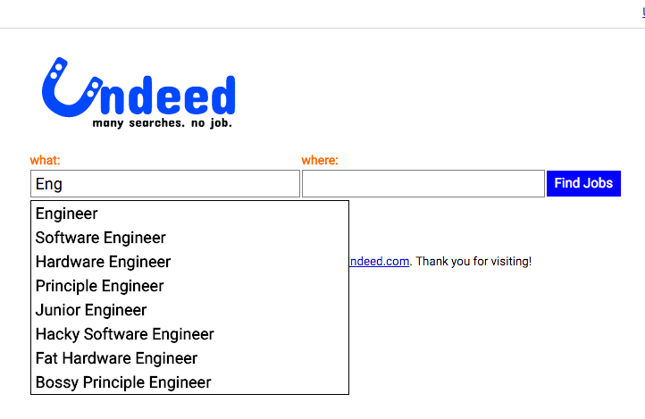
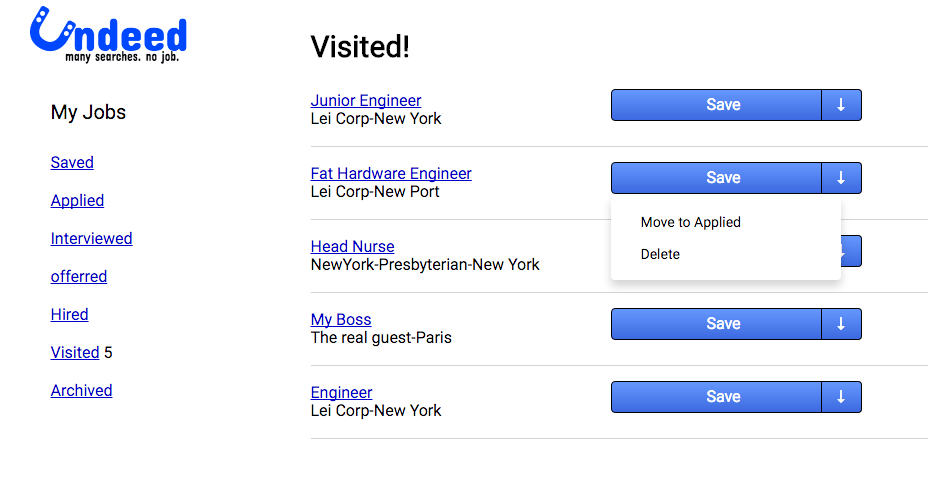
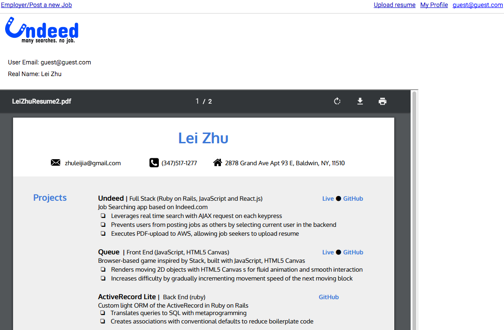

# Undeed

[live][heroku]

[heroku]: http://www.undeed.xyz
## Description
Undeed is a job searching website inspired by Indeed.com. It is a single-page app that helps job seekers search, organize and apply jobs, and help employers post jobs and view applications at the same time.

## Technical implementation details
- One Page App using React, Flux and React Router
- Real Time Auto-Suggest with AJAX request in the search bar
- Both FrontEnd and BackEnd validation for better user feedback and higher security
- Upload images through Paperclip and AWS
- Secure Password encryption with Brcypt
- CSRF Authenticity Token enabled
- Log In with facebook with OmniAuth Using OAuth2 Strategy

Index Page

My Jobs Page

Resume Page

## Technology
- Ruby on Rails
- React.js
- Postgresql

### Libraries / Gems Implemented
* ReactJS
* Figaro
* omniauth-facebook
* JBuilder
* ReactRouter
* Flux
* Paperclip
* react-paginate
* react-click-outside

### Languages
* JavaScript
* Ruby
* HTML
* CSS
* SQL

### TODOs / Future Features (TBD)
- [ ] More Job Search filters
- [ ] Save application in database
- [ ] Search History
